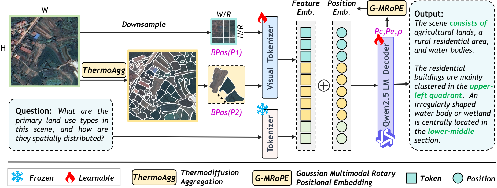
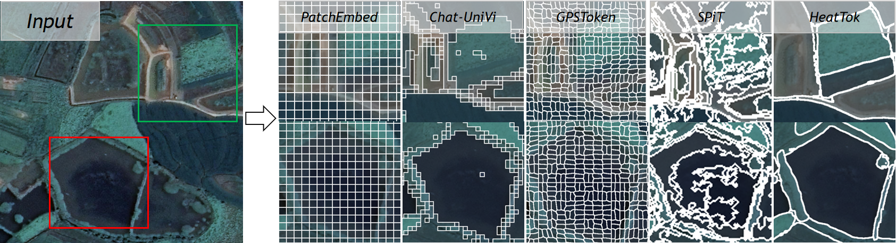

<div align="center">

# [ACM MM 2026] HeatTok: Enhancing Remote Sensing Image Understanding via Thermodiffusion-based Tokenization

<p>
  Yingying Yan<sup>∗</sup>,
  Jiaqi Tang<sup>∗</sup>,
  Wei Wei<sup>†</sup>,
  Qianzhou Wang,
  Jinjian Wu,
  Botong Geng,
  Jianmin Chen,
  Yuyang Xia,
  Lei Zhang
</p>

<p>
Northwestern Polytechnical University, Hong Kong University of Science and Technology
</p>

<p><sup>∗</sup> Equal contribution. <sup>†</sup> Corresponding author.</p>

<a href="https://github.com/YingyingYan1/HeatTok"></a>
<a href="https://arxiv.org/abs/2608.22485"></a>
<a href="#models"></a>
<a href="LICENSE"></a>

Official repository for **HeatTok**.

</div>

---

## 📰 News

- [2026.08] [Code](https://github.com/YingyingYan1/HeatTok) released.
- [2026.08] [Paper](https://arxiv.org/abs/2608.22485) released on arXiv.
- [2026.07] 🎉 HeatTok was accepted by ACM MM 2026!

---

## 🔎 Overview

Current visual tokenizers in Multimodal Large Language Models (MLLMs) predominantly rely on patch-based partitioning, which causes severe semantic mixture and object fragmentation in remote sensing imagery due to the irregular contours of geo-objects. Moreover, existing adaptive methods struggle to extract precise object-level tokens and lack dedicated geometric positional encodings for irregular regions.

We propose **HeatTok**, a semantic-aware tokenizer driven by thermodiffusion aggregation. Inspired by the physical principles of heat conduction, HeatTok adaptively merges adjacent homogeneous regions to generate semantically independent, object-aligned irregular tokens. To enable MLLMs to perceive these irregular shapes, we design the **Gaussian Multimodal Rotary Positional Embedding (G-MRoPE)**, which models token spatial distributions via 2D Gaussians and explicitly injects center, scale, and orientation cues.


### Key Contributions

- **HeatTok**: A semantic-aligned tokenizer that utilizes a thermodiffusion mechanism to adaptively aggregate fine-grained regions. By merging adjacent homogeneous areas, it generates boundary-adherent tokens, substantially reducing semantic mixture and fragmentation.
- **G-MRoPE**: Injects the Gaussian center, scale, and orientation parameters of irregular tokens into M-RoPE. This endows MLLMs with robust positional representations and precise perception of scale and orientation.

<p align="center">
  
</p>

<p align="center">
  
</p>

---

## 🛠️ Installation

HeatTok is built on top of [LLaMA-Factory](https://github.com/hiyouga/LLaMA-Factory). Follow these steps to set up the environment:

```bash
git clone https://github.com/YingyingYan1/HeatTok.git
cd HeatTok
```

You can also install dependencies directly with:

```bash
pip install -r requirements.txt
```

This is a quick one-shot setup option. For CUDA-sensitive packages (e.g., PyTorch, `torch-scatter`, `flash-attn`), the step-by-step installation below is still recommended.

### 1. Create Conda Environment

```bash
conda create -n heatok python=3.11 -y
conda activate heatok
```

### 2. Install PyTorch (CUDA 11.8 example)

```bash
pip install torch==2.4.0 torchvision==0.19.0 torchaudio==2.4.0 \
  --index-url https://download.pytorch.org/whl/cu118
```

### 3. Install LLaMA-Factory

```bash
pip install -e .
```

### 4. Install FastSAM Dependencies


```bash
pip install opencv-python pillow tqdm seaborn scikit-learn scikit-image
```

### 5. Install HeatTok Additional Dependencies

```bash
pip install torch-scatter -f https://data.pyg.org/whl/torch-2.4.0+cu118.html
pip install flash-attn --no-build-isolation   
pip install deepspeed                          

### 6. Meta SAM (Optional)

If you want to use Meta SAM instead of FastSAM:

```bash
cd segment-anything-main
pip install -e .
```


## 🤖 Models

| Model | Dataset | Checkpoint |
|:------|:--------|:-----------|
| HeatTok-Qwen2.5-VL-7B | VRSBench | [Download]() |
| HeatTok-Qwen2.5-VL-7B | EarthVQA | [Download]() |

> Model weights will be released soon.

---

## 📦 Data Preparation

Place the datasets under the repository root with the following layout (relative paths):

```text
.
├── VRSBench/          # VRSBench images and annotations
├── EarthVQA/          # EarthVQA images and annotations
└── data/
    ├── dataset_info.json
    ├── vrsbench.jsonl
    └── EarthVQA.jsonl
```

### VRSBench

VRSBench is a visual question answering benchmark for remote sensing images, covering question types including category, existence, quantity, color, shape, size, position, direction, scene, and reasoning.

### EarthVQA

EarthVQA is a relation-reasoning VQA dataset for queryable Earth, containing basic judgment, relation judgment, basic counting, relation counting, object analysis, and comprehensive analysis question types.


---

## 🔥 Preprocessing: Semantic Patch Cache

HeatTok uses thermodiffusion-based preprocessing to generate semantic patches. You can **pre-generate** the cache files before training for faster training speed, or let the training process compute them online (slower).

### Pre-generate Cache (Recommended)

```bash
# Single-GPU pregeneration
python scripts/pregenerate_semantic_cache.py \
    --config examples/train_lora/qwen2_5vl_lora_sft.yaml

# Multi-GPU parallel pregeneration (e.g., 8 GPUs)
bash scripts/parallel_pregenerate.sh 8

# Specify GPU IDs (e.g., use GPUs 4,5,6,7)
bash scripts/parallel_pregenerate.sh 4 "4,5,6,7"
```

Cache files are saved to `src/semantic_patch_cache/` with the naming format:
```
{image_hash}_g{0|1}_gd{8}_s{semantic_patch_size}.pt
```

---

## 🚀 Training

### Configuration

The main training configuration is at `examples/train_lora/qwen2_5vl_lora_sft.yaml`:


### Launch Training

```bash
# Adjust CUDA_VISIBLE_DEVICES / NPROC_PER_NODE / MASTER_PORT for your machine.
CUDA_VISIBLE_DEVICES=0,1,2,3,4,5,6,7 \
MASTER_ADDR=127.0.0.1 \
MASTER_PORT=29501 \
FORCE_TORCHRUN=1 \
NPROC_PER_NODE=8 \
llamafactory-cli train examples/train_lora/qwen2_5vl_lora_sft.yaml
```

### Key HeatTok Parameters

| Parameter | Description | Default |
|:----------|:------------|:--------|
| `use_semantic_patches` | Enable HeatTok semantic tokenization | `true` |
| `global_downsample` | Enable global branch for scene-level context | `true` |
| `semantic_patch_size` | Target size for semantic patches | `28` |
| `sam_backend` | Segmentation backend: `fastsam` / `sam` / `auto` | `fastsam` |
| `sam_checkpoint` | Path to FastSAM (`.pt`) or SAM (`.pth`) weights | Required |

---

## 📊 Evaluation

Evaluation code will be uploaded soon.

## 🎨 Quick Visualization

For a lightweight qualitative check, you can run the demo in `visualization/` to visualize HeatTok merged token boundaries on sample images.

```bash
CUDA_VISIBLE_DEVICES=0 python visualization/visualize_heatok.py
```


---

## 📌 Citation

If you find HeatTok useful in your research, please cite our paper:

```bibtex
@inproceedings{yan2026heatok,
    title={HeatTok: Enhancing Remote Sensing Image Understanding via Thermodiffusion-based Tokenization},
    author={Yingying Yan and Jiaqi Tang and Wei Wei and Qianzhou Wang and Jinjian Wu and Botong Geng and Jianmin Chen and Yuyang Xia and Lei Zhang},
    booktitle={Proceedings of the 34th ACM International Conference on Multimedia},
    year={2026},
    publisher={ACM},
    address={Rio de Janeiro, Brazil},
    doi={10.1145/3767308.3835640}
}
```

---

## 🤝 Acknowledgements

We thank the authors of [LLaMA-Factory](https://github.com/hiyouga/LLaMA-Factory) for their excellent unified fine-tuning framework, [SAM](https://github.com/facebookresearch/segment-anything) ([Segment Anything](https://github.com/facebookresearch/segment-anything)) and [FastSAM](https://github.com/CASIA-LMC-Lab/FastSAM) for segmentation backends, and [Qwen2.5-VL](https://github.com/QwenLM/Qwen2-VL) for the powerful multimodal foundation model.

---
