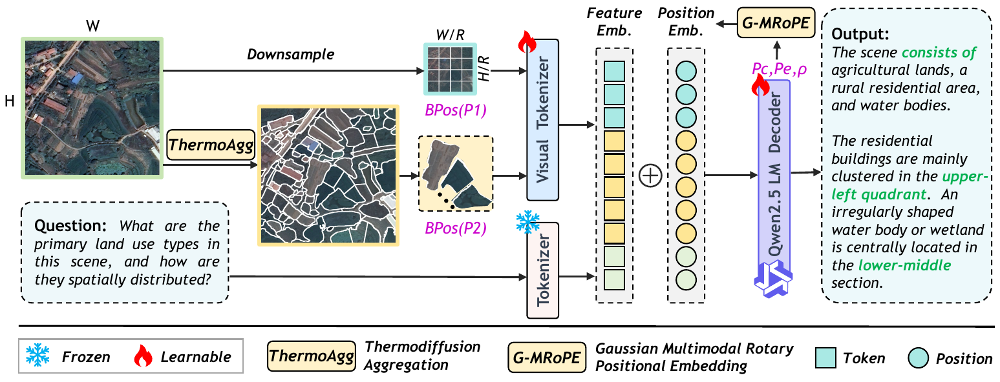

# [ACM MM 2026] HeatTok: Enhancing Remote Sensing Image Understanding via Thermodiffusion-based Tokenization

Yingying Yan\*, Jiaqi Tang\*, Wei Wei†, Qianzhou Wang, Jinjian Wu, Botong Geng, Jianmin Chen, Yuyang Xia, Lei Zhang

\* Equal contribution. † Corresponding author.

Official repository for **HeatTok**.

---

## 🔎 Overview

## 🛠️ Code

Code: **Coming soon**.
